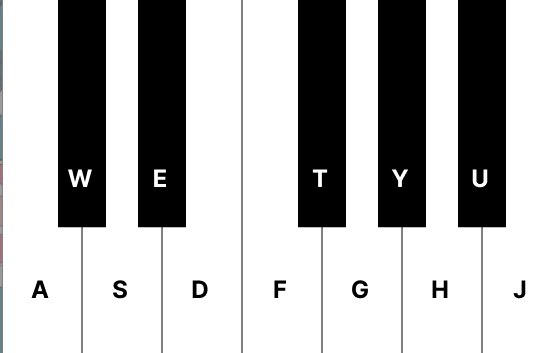
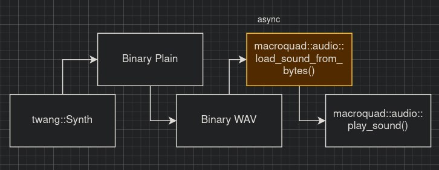

# Synth Test

### Controls:

---

This proves the capabilities of the `macroquad` engine to make a synthesizer using `twang` library. The audio supports in `macroquad` is pretty basic, there isn't any method to feeds the audio directly without converting into a formated binary first (as a WAV or other format) or I just don't know how.

